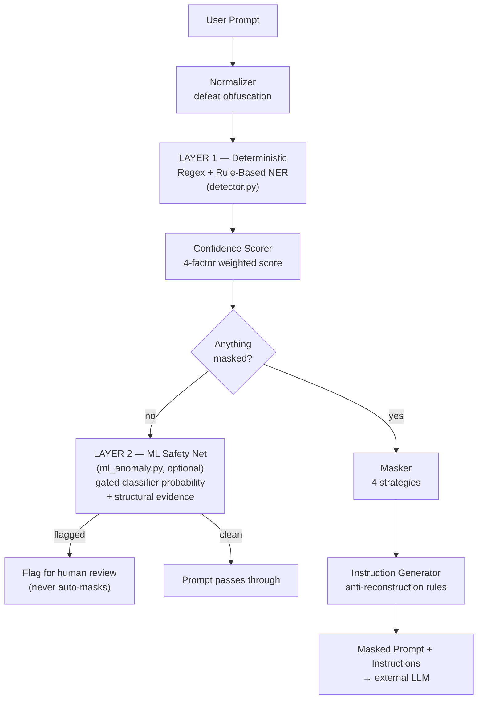
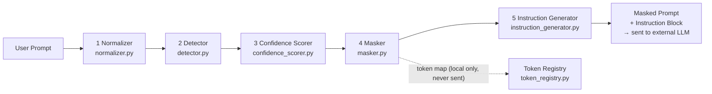

# R26-CS-012 — Context-Aware Masking + Instruction Engine
## Comprehensive Technical Documentation (Research Evaluation Panel)

**Project title:** AI-Safe Data Masking and Leakage Prevention Framework
**Component documented:** Context-Aware Masking + Instruction Engine
**Author:** Abayathilake S.S — IT22193186
**Domain:** Banking Sector (Sri Lanka + International)
**Document scope:** Security architecture and threat model, detection/masking logic, the hybrid regex+ML detection design, evaluation results, the PP1 panel-review fix log, and known limitations of the current implementation.

---

## 1. Executive Summary

Large Language Model (LLM) assistants (ChatGPT, Copilot, Gemini, Claude) are increasingly used inside banking workflows, but employees routinely paste real customer data, credentials, and internal system details into these prompts. Once sent, that data leaves the organization's security boundary — and, as Section 2's case study shows, a single uncovered gap in one layer of data handling is historically all it has taken for that boundary to fail at scale.

This project implements a **pre-transmission masking layer**: a control that sits between the user and the external LLM, scans every prompt, detects sensitive data against a purpose-built **7-category sensitive-data taxonomy** (banking PII, PCI card data, credentials, infrastructure secrets, banking-specific data, contextual leaks, and cloud architecture secrets), assigns each detection a **traceable confidence score**, masks it with a strategy appropriate to its risk level, and appends **explicit instructions** telling the LLM not to try to reconstruct the masked values.

Detection runs as **two independent layers**, a deliberate defense-in-depth design (Section 3):

- **Layer 1 — deterministic regex + rule-based NER.** Pure Python 3.8+, zero runtime dependencies, every decision traceable to one named rule. This is the layer that can make a `mask_immediate` decision on a CRITICAL entity, because every such decision must be auditable for PCI-DSS/GDPR/CBSL/SWIFT-CSP compliance.
- **Layer 2 — a trained ML classifier, wired into the live pipeline as a safety net.** It only ever activates when Layer 1 finds nothing at all. The model's score never decides *what* to redact — a separate deterministic rule locates the specific secret-shaped span, which is then masked and tokenized the same way a Layer-1 value is; if no span can be located, it falls back to flagging the prompt for review instead of guessing. Section 8 documents this integration in full, including an honest, evaluated finding that the classifier alone overfits to synthetic-dataset structure, and the structural-evidence gate built to correct for it before this layer was allowed to ship.

**Current measured accuracy** (`evaluate.py` against a 5,012-prompt synthetic dataset): **Precision 95.1% / Recall 93.2% / F1 94.1%**, a **95.9% adversarial-obfuscation detection rate**, a **0.0% edge-case false-positive rate**, and — evidence the ML layer is doing genuine work, not decoration — **123 prompts where Layer 1 found nothing but Layer 2 correctly caught real sensitive content (103 masked outright, 20 routed to review when no exact span could be pinned down), with a verified 0% false-alarm rate on a genuinely held-out out-of-distribution probe set** (Section 8.3, Section 10.4).

---

## 2. Real-World Motivation: What the Optus Breach Evaluates To

A research panel asking "why does this architecture look the way it does" deserves a concrete incident, not just abstract compliance language. The 2022 Optus (Australian telecommunications) breach is the clearest case study for this project's specific design choices.

**What happened.** An internal API used to serve customer data was reachable without authentication and without any output-side data protection. An attacker enumerated it and retrieved close to 9.8 million customer records — full names, dates of birth, phone numbers, email addresses, and for a large subset, passport and driver's-licence numbers: exactly the PII categories this engine's Category 1 taxonomy targets. No credential theft or social engineering was required; the data was simply returned in full by a system with **no masking, no output-side inspection, and a single point of failure** (one API's access control) standing between raw customer PII and the outside world.

**What this project evaluates from it, concretely:**

| Optus failure mode | Design response in this project |
|---|---|
| A single control (API auth) was the entire boundary — no second layer caught the gap | **Defense in depth**: two independent detection layers (Section 3), so one layer's blind spot is not the whole story for the system |
| Data left the organization in full, unmasked, by design (the API's job was literally to return it) | Every prompt to an external LLM is masked **before transmission** — the masking layer sits on the one channel this project controls, and never trusts the destination to handle raw PII responsibly |
| No detection layer existed to notice the anomalous, high-volume PII disclosure at all | The masking decision here is made **per-prompt, synchronously, before send** — not as after-the-fact log analysis, so there is no window where the same failure mode (undetected mass disclosure) can run to completion |
| Passport/driver's-licence numbers — structured, well-known ID formats — were exposed identically to everything else | This project treats those specific formats as **first-class, individually validated entity types** (`PASSPORT`, `DRIVING_LICENSE`, with format checks in `confidence_scorer.py`) rather than generic "PII," which is exactly the category Optus's flat, undifferentiated data model failed to protect |
| The exposure was total and instantaneous once found — no rate limiting or anomaly detection slowed it down | The ML safety-net layer (Section 8) is explicitly framed as **anomaly detection on the one channel this project owns** — a second opinion that doesn't require a known signature, so a structurally sensitive-shaped disclosure with no matching regex still gets a chance to be caught |

The throughline is not "Optus used regex wrong" — they had no equivalent control at all. The lesson evaluated here is narrower and more useful: **a single detection layer, however well-built, is a single point of failure**, and a system that handles the same class of data Optus exposed (national ID formats, contact PII, in this case *also* financial and credential data) should not depend on one mechanism being right every time. That is the reasoning behind the two-layer architecture in Section 3, not a retrofitted justification for it.

---

## 3. Security Architecture: Defense in Depth, Not a Single Filter

The system is best understood as a **security control**, not a text-processing pipeline that happens to redact things. It exists because the honest threat model is: *employees will paste sensitive data into external LLMs — that is normal, expected behavior, not a policy violation to police after the fact* — and the only defensible response is a control that makes that behavior safe by construction.



**Why two layers, and why in this order:**

1. **Layer 1 must be the only layer that can act (mask).** Every `mask_immediate` decision has to be traceable to one named rule for PCI-DSS/GDPR/CBSL/SWIFT-CSP audit — an opaque model score cannot be the reason a CRITICAL entity was or wasn't masked. Section 3.1 below expands the rationale.
2. **Layer 2 exists because Layer 1, by construction, can only catch a pattern someone already wrote a rule for.** It cannot generalize to a novel secret format or obfuscated phrasing that dodges every regex. That gap is real, and pretending it doesn't exist is worse than documenting it — see Section 8.
3. **Layer 2 is bounded so it cannot become a new liability.** It only runs when Layer 1 found *nothing*, its model score never chooses what to redact (a separate deterministic rule does, or it defers to human review if that rule finds nothing), and — after an evaluated false-positive finding (Section 8.3) — it requires independent structural corroboration before it is allowed to surface anything at all. A security enhancement that itself becomes a source of noise or false confidence is not a net improvement; this project treats that as a real risk to design against, not an acceptable cost of "having ML."
4. **The system must keep working if Layer 2 is entirely unavailable.** `engine/` is zero-dependency by design so the compliance-critical path can run fully air-gapped; Layer 2's model/library dependency is soft and optional (Section 8.2) precisely so a missing optional enhancement can never take down the control that actually matters.

### 3.1 Why Layer 1 is regex + rule-based NER, not a statistical/NLP model

This is stated directly in the code (`detector.py`):

```python
WHY REGEX + RULE-BASED NER (not ML model here):
  - Regex is deterministic and auditable — required for PCI-DSS/GDPR compliance
  - Each detection decision can be traced to a specific rule (explainability)
  - Zero external dependencies — runs in air-gapped banking environments
  - ML NER (spaCy) would be layered on top in production; rule-based is
    sufficient for a progress demo and covers the core research scope
```

| Reason | What it means concretely | How it strengthens the security posture |
|---|---|---|
| **Determinism & auditability** | A rule-based match always produces the *same* decision for the *same* input, traceable to one named rule in `NER_KEYWORDS`/`PATTERNS`. A statistical model instead returns a probability learned from opaque training data. | For a PCI-DSS/GDPR/CBSL audit, "this text matched rule R with these keywords" is verifiable line-by-line; "the model's confidence was 0.83" is not, can drift silently between model versions, and can't be signed off as a fixed control. |
| **No adversarial/model-drift attack surface on the acting layer** | Regex/keyword rules can't be fooled by adversarial-example techniques that exploit a neural model's decision boundary, and don't change behavior when a vendor pushes a model update. | Removes an entire class of evasion attack against the layer that actually masks data, and removes the operational risk of a silent accuracy regression from an upstream model update. |
| **Zero external dependencies / air-gapped operation** | `engine/` is pure Python 3.8+ — no model weights, no native runtime, nothing to download. | A banking deployment can run fully air-gapped with a minimal, auditable dependency footprint — a smaller supply-chain attack surface for the component handling the most sensitive data in the system. |
| **Predictable latency, no inference cost** | Regex/keyword matching has no GPU/CPU inference step. | Keeps Layer 1 cheap enough to run synchronously on *every* prompt with no incentive to skip or sample-check it for performance — a control that's always fast enough to run is a control that actually gets used. |

**The honest tradeoff** (expanded fully in Section 8): rule-based Layer 1 only catches what matches its patterns or keyword lists — it has no generalization to genuinely novel formats. That is precisely the gap Layer 2 exists to narrow, deliberately kept powerless to act on its own so it cannot undermine the guarantees above.

---

## 4. High-Level Pipeline Architecture

Within Layer 1, the engine is a **five-stage sequential pipeline**. Every prompt passes through all five stages; there is no early-exit shortcut.



### 4.1 Stage-by-stage summary

| # | Stage | File | Input → Output | Purpose |
|---|---|---|---|---|
| 1 | **Normalizer** | `engine/normalizer.py` | raw text → normalized text + context type + transformation log | Defeats adversarial obfuscation (spaced-out digits, URL/hex/Base64 encoding) and classifies the prompt's *context type* (natural language / source code / config file / log output / mixed) |
| 2 | **Detector** | `engine/detector.py` | normalized text → list of `DetectedEntity` | Runs ~30 compiled regex patterns (per taxonomy category) plus lightweight rule-based NER (names, addresses, DOB) against both the normalized and de-spaced text |
| 3 | **Confidence Scorer** | `engine/confidence_scorer.py` | entities + text → list of `ScoredEntity` (0.00–1.00 + action) | Resolves ambiguity (e.g. "is this 12-digit number an NIC or a random serial?") using a 4-factor weighted score; also resolves overlapping/competing detections |
| 4 | **Masker** | `engine/masker.py` | scored entities + text → `MaskedResult` | Chooses one of 4 masking strategies per entity and rewrites the prompt; records what was masked and what was skipped and why |
| 5 | **Instruction Generator** | `engine/instruction_generator.py` | `MaskedResult` → instruction payload | Appends a Standard or CRITICAL instruction block telling the downstream LLM not to reconstruct/guess masked values |

A sixth component, the **Token Registry** (`engine/token_registry.py`), runs alongside stage 4: a session-scoped, in-memory map guaranteeing the *same* real value always maps to the *same* token (`<APIKEY_1>`) within a session, **never transmitted** — it exists purely so the calling application can un-mask the LLM's reply locally if needed.

---

## 5. Deep Dive: Each Stage

### 5.1 Normalizer — defeating obfuscation, classifying context

Before any pattern matching happens, the normalizer runs four transformations, in this fixed order:

1. **URL-decode** (`password%3DSecure99%40` → `password=Secure99@`)
2. **Hex-decode** long even-length hex runs that decode to printable text
3. **Base64-decode** candidate segments ≥20 chars (with a carve-out: strings starting `eyJ` are left alone so the dedicated JWT pattern can match the three-part structure instead of being destroyed by decoding)
4. **Adversarial spacing removal** — collapses spaced-out identifiers (`1 9 9 0 1 2 3 4 5 V` → `199012345V`)

Step 4 is scoped narrowly (3+ consecutive short tokens containing ≥2 digits, or 4+ single-character tokens for a spelled-out keyword like `P a s s w o r d`) so it does **not** collapse ordinary sentences into false API-key-shaped strings.

Because de-spacing shortens the text, the normalizer returns a **character-index map** (`despaced_map`) so a match found in the shortened copy translates back to the correct span in the original text — this is what lets the detector run a second adversarial-detection pass without corrupting mask positions.

### 5.2 Detector — regex + rule-based NER (Layer 1)

`detector.py` holds a registry of **~30 compiled regex patterns**, one row per taxonomy entity type:

```python
("NIC_OLD",   r'\b\d{9}[vVxX]\b',              "HIGH",     "1A", "exact"),
("PAN",       r'\b\d(?:[ \-]?\d){12,18}\b',    "CRITICAL", "2A", "partial"),
("PRIVATE_KEY", r'-----BEGIN (RSA |EC )?PRIVATE KEY-----', "CRITICAL", "3C", "exact"),
```

Three entity types use **lightweight rule-based NER** instead (a dependency-free substitute for a full NLP NER model — see Section 3.1 for why):

- `FULL_NAME` — title + capitalized name, or first-name + a curated list of Sri Lankan surnames (`sl_names.py`)
- `DATE_OF_BIRTH` — DOB keyword + date (the bare-ISO-date fallback additionally requires a nearby DOB keyword — see Section 9's fix #8)
- `HOME_ADDRESS` — a bounded run of name-words followed by a street-type keyword as its own token (Road/Street/Lane/Mawatha/…) — see Section 9's fixes #12–#15 for why the word-boundary and bounding matter

Several structural safeguards keep detection precise:

- **Keyword-gated detection types** (`CVV`, `TAX_ID`, `BANK_ACCOUNT_NO`, `API_KEY_GENERIC`) only register as candidates if a relevant keyword appears within ±5 tokens or glued directly onto the value (`api_key=VALUE`).
- **Non-sensitive-identifier suppression** — a business-reference phrase directly before a generic numeric identifier ("transaction ID", "invoice reference", "order reference", "tracking number"…) suppresses an otherwise-matching NIC/phone/TIN candidate, added specifically from panel-review findings (Section 9, fixes #1/#10/#11).
- **Ambiguous type groups** (`NIC_NEW` vs `BANK_ACCOUNT_NO`, `PASSWORD` vs `API_KEY_GENERIC`, etc.) deliberately both match the same span; the confidence scorer picks the winner later based on context, not registration order.
- **Container types** (`PAN`, `JWT_TOKEN`, `JWT_IN_LOG`) "claim" their whole matched span so internal digit/segment groups aren't independently re-matched as smaller entities.
- **NER-vs-detected overlap exclusion** — a fuzzy NER match (especially `HOME_ADDRESS`) can never overlap a span a more precise regex/keyword pass already confirmed, so a malformed address match can't swallow a bank account number into a corrupted mask (Section 9, fixes #13–#15).
- The detector runs **twice** — once on the normalized text, once on the de-spaced text — so adversarially spaced identifiers are still caught, with positions translated back via `despaced_map`.

### 5.3 Confidence Scorer — 4-factor weighted scoring

This is the component that resolves the taxonomy's own worked ambiguity example: *"the number `200423910321` could be an NIC or a random serial number — how does the engine decide?"*

Every detected entity gets a score in **[0.00, 1.00]** from four weighted factors:

| Factor | Weight | What it measures |
|---|---|---|
| **Pattern Match Strength** | 40% | Exact vs. partial regex match quality |
| **Context Keyword Proximity** | 30% | Is a relevant keyword within ±5 tokens, or glued directly onto the value? |
| **Co-occurrence Boost** | 20% | Do other detected entities appear in the same prompt — especially a curated "dangerous pair" (Name+NIC, Email+Password, AWS key pair, …)? |
| **Format Validity** | 10% | Does the value pass a structural check — Luhn, NIC digit-sum/date-plausibility, IBAN format, Sri Lankan mobile/landline prefix table, etc.? |

```
weighted_score = 0.40·pattern + 0.30·keyword_proximity + 0.20·co_occurrence + 0.10·format_validity
```

| Score | Confidence | Action |
|---|---|---|
| 0.90 – 1.00 | Very High | `mask_immediate` |
| 0.75 – 0.89 | High | `mask_immediate` |
| 0.50 – 0.74 | Medium | `mask_warn` (masked + logged for review) |
| 0.25 – 0.49 | Low | `log_suspected` (not masked, flagged) |
| 0.00 – 0.24 | Very Low | `ignore` (treated as false positive) |

**Worked example** (from the taxonomy spec, reproduced by the engine): `"Customer reference: 200423910321"` → **0.80 → mask_immediate**, vs. the same number with zero surrounding context, which never crosses the masking threshold at all.

**Overlap resolution:** `resolve_overlapping_entities()` runs after scoring and keeps the higher-scoring candidate for any contested/overlapping span — including same-type duplicate detections at slightly different offsets (a fix from the panel review, Section 9's #9) — so the *decision* is made by context and validators, never by pattern-registration order.

### 5.4 Masker — four masking strategies

| Strategy | When | Example |
|---|---|---|
| **Full Mask** | CRITICAL/HIGH PII, CVV, passwords, private keys | `P@ssw0rd` → `********` |
| **Partial Mask** | MEDIUM sensitivity — phone, email, PAN | `0771234567` → `077****567` |
| **Tokenization** | Credentials, IDs, cloud resources needing cross-prompt traceability | `sk-abc123...` → `<APIKEYGE_1>` |
| **Contextual** | LOW sensitivity types (`FULL_NAME`, `GENDER`, `RACE_ETHNICITY`) | A name mentioned alone is **not** masked; masked only if a HIGH/CRITICAL entity co-occurs |

Entities are replaced **right-to-left** by character position so earlier replacements never shift the offsets of entities still waiting to be masked — this ordering guarantee is exactly what the panel-review fixes in Section 9 (#12–#15) protect, by ensuring only genuinely non-overlapping spans ever reach this stage.

### 5.5 Token Registry — idempotent, session-scoped, local-only

```python
registry.get_or_create_token("sk-abc123...", "API_KEY_GENERIC")   # → "<APIKEYGE_1>"
registry.get_or_create_token("sk-abc123...", "API_KEY_GENERIC")   # → "<APIKEYGE_1>"  (same value, same session)
registry.get_or_create_token("sk-xyz999...", "API_KEY_GENERIC")   # → "<APIKEYGE_2>"  (different value → incremented)
```

The map lives only in the calling process's memory, is destroyed when the session ends, and — critically — **is never part of the payload sent to the external LLM.**

### 5.6 Instruction Generator — the second half of the defense

Masking alone does not stop an LLM from *guessing* what a masked value probably was:

- **Standard tier** (MEDIUM/LOW risk): don't infer/reconstruct masked tokens, treat them as opaque placeholders, don't ask the user to reveal them, treat repeated tokens as the same entity.
- **CRITICAL tier** (HIGH/CRITICAL risk, or any of `CVV`/`PRIVATE_KEY`/`SWIFT_MT103`/`SWIFT_MT202`/`PASSWORD`/`JWT_TOKEN`/`AWS_SECRET_KEY`/`DB_CONNECTION_STRING`): the same instructions plus explicit "flag for security review" language, satisfying **SWIFT CSP Mandatory Control 6.1**.

---

## 6. Sensitive Data Taxonomy (What the Engine Is Built Against)

The taxonomy (`sensitive_data_taxonomy_v2.md`, v2.0) is the **ground-truth spec** the engine implements against — every regex, keyword list, and scoring rule traces back to a row in this document. It defines **7 top-level categories**:

```
1. Personally Identifiable Information (PII)     — NIC, passport, phone, email, address, name, DOB
2. Financial & Payment Data                      — card (PCI-DSS), bank account, IBAN, SWIFT, transactions
3. Credentials & Authentication Secrets          — API keys, JWTs, passwords, private keys
4. Configuration & Infrastructure Secrets        — env vars, DB connection strings, internal IP/hostnames
5. Banking-Specific Organizational Data          — customer/loan IDs, credit score, SAR/AML/KYC, SWIFT refs
6. Contextual & Implicit Sensitive Data          — credentials in code comments, internal doc references
7. Cloud Infrastructure & Architecture Secrets   — AWS ARNs, S3/Azure/GCS references, encoded secrets
```

It maps to six regulatory frameworks: **GDPR**, **PCI-DSS v4.0**, **CBSL** (Central Bank of Sri Lanka), **SWIFT CSP**, **HIPAA**, and **ISO/IEC 27001**. The engine implements detection for **~30 entity types** spanning categories 1A/1B/1C, 2A/2B/2C, 3A/3B/3C, 4B/4C, 7A/7B/7C.

**Sensitivity scoring matrix** (drives default masking strategy before confidence adjustment):

| Level | Score | Examples |
|---|---|---|
| CRITICAL | 10 | CVV, SWIFT messages, private keys, SAR data |
| HIGH | 7–9 | API keys, NIC, IBAN, JWT, passwords, cloud keys |
| MEDIUM | 4–6 | Phone, email, internal IP, S3 bucket, hostname |
| LOW | 1–3 | Names alone, currency amounts, GCP project IDs |

**Co-occurrence elevation rules** — some combinations are more dangerous together than either value is alone:

| Combination | Individual | Elevated to |
|---|---|---|
| Name + NIC | LOW + HIGH | CRITICAL |
| Email + Password | MEDIUM + HIGH | CRITICAL |
| Account No + Balance + Name | HIGH + HIGH + LOW | CRITICAL |
| AWS ARN + AWS Secret Key | MEDIUM + HIGH | CRITICAL |

---

## 7. How the Engine Handles Semantic / Ambiguous Input

This is the question a research panel is most likely to probe: **regex can only match fixed syntax — how does this system handle meaning?** The answer now spans both layers described in Section 3.

### 7.1 Layer 1: context-driven disambiguation (not true semantics, but not naive regex either)

Layer 1 does not "understand" language the way an embedding model does, but it does **use surrounding context to resolve ambiguity that a bare regex cannot** — the entire purpose of the confidence-scoring stage (Section 5.3):

- A structurally identical 12-digit number is treated completely differently depending on **what words surround it** ("Customer reference: …" masks; the same digits with no surrounding keyword and no co-occurring PII are never masked).
- **Non-sensitive-identifier suppression** (Section 5.2, and Section 9's #1/#10/#11) is a second layer of the same idea: a "transaction ID"/"invoice reference" phrase overrides an otherwise-matching generic keyword, so the engine distinguishes *which kind* of identifier a number is, not just *whether* a keyword is nearby.
- **Co-occurrence reasoning** is a limited form of relational understanding: "is this value sensitive *given what else is in the same prompt*" (Name + NIC together implies a real, identifiable customer record; either alone does not).
- **Known, documented limitation:** keyword-proximity heuristics cannot resolve genuine linguistic ambiguity — "Debit LKR 50,000 from account X" still matches the `PAN` boost-keyword list because "debit card" is a legitimate adjacent phrase, and the engine has no part-of-speech awareness to know "Debit" is a verb here.

### 7.2 Layer 2: the ML safety net (see Section 8 for the full write-up)

Where Layer 1 cannot generalize — a genuinely novel secret shape, or phrasing with no matching keyword at all — a trained classifier now runs as a second, independent opinion, live in the pipeline. Section 8 covers the design, the honest evaluation of its limits, and the gate built to keep it safe.

---

## 8. The ML Layer: Use Case, Integration, and What It Actually Does for Security

This section exists because "we only used regex, no model" is not, on its own, a defensible answer for a system handling this much sensitive data — a purely signature-based control has a structural blind spot (Section 2's Optus lesson), and a research panel is right to ask how that gap is addressed. This section documents the real, running integration: what the model is, what it is for, how it is wired into the product, and — just as importantly — a limitation found during evaluation and the fix built for it, because a credible ML claim requires evidence of scrutiny, not just a reported accuracy number.

### 8.1 Use case: catching the "unknown unknowns"

Layer 1 can only catch a pattern someone already wrote a rule for. The ML layer's job is narrower and specific: **flag prompts that are structurally sensitive-shaped — high entropy, long opaque tokens, secret-adjacent vocabulary — even when no named regex matches at all**, so they reach a human reviewer instead of silently passing through unmasked. This is the same principle behind anomaly detection in any security program: a system that only recognizes known signatures will always miss the first occurrence of something new.

### 8.2 What is actually trained, and the real link to the product

The classifier (`research/models_rf_classifier.pkl`, a scikit-learn `StandardScaler` + `GradientBoostingClassifier` pipeline) is trained in `research/Colab_Masking_Engine_Lab.ipynb` on **17 structural/entropy features** — Shannon entropy, token-length ratios, digit-run counts, base64/hex pattern flags, secret-adjacent keyword flags — extracted from **the same synthetic dataset** (`data/synthetic_dataset.json`) that `evaluate.py` uses to score Layer 1. That shared dataset is the concrete link between "what we trained" and "what the product does": both layers are validated against the same ground truth, so their numbers are directly comparable, and both are exercised by the same evaluation run (`evaluate.py`'s `ml_safety_net` block, Section 7.4).

At runtime, `engine/ml_anomaly.py` loads this trained model and is called from every entry point — `main.py`, `web/server.py`, and `evaluate.py` — immediately after masking:

```python
apply_safety_net(norm["normalized"], masked_result)
```

This is a genuine production dependency, not a benchmark run on the side: the CLI, the live web demo, and the evaluation harness all execute the same trained model on every prompt. It is optional only in the sense that `engine/`'s zero-dependency guarantee (Section 3, point 4) must survive scikit-learn being unavailable — if it is, Layer 2 silently no-ops and Layer 1 continues unaffected; this was verified directly (`tests/test_ml_anomaly.py`, and by running the full 55-test suite both with and without scikit-learn installed).

### 8.3 An evaluated limitation, and the fix — this is the part that matters

The classifier reports **98.75% accuracy** on the synthetic dataset it was trained and validated on. Taken at face value, that number is a strong pitch. It is also, on its own, misleading — and finding that out, not just quoting the headline number, is the actual security-engineering work here.

Testing the model directly against out-of-distribution text (ordinary sentences with none of the 17 features' structural secret-markers) surfaced this:

| Prompt | Structural evidence? | Classifier P(sensitive) |
|---|---|---|
| *"The weather in Colombo today is sunny with a chance of rain in the evening."* | None | **98.1%** |
| *"Please send me the report by Friday, thanks for the update on the branch meeting."* | None | **93.0%** |
| *"Rotate this credential immediately: Zx9kQm2vLp7Tn4Rc8Yw1Fh6Ub3Ej0Sg5Aq2Bn9Cx4Rt3Ol8Wm1."* (genuinely secret-shaped) | Base64-pattern, high entropy | **19.4%** |

The classifier had learned to distinguish the dataset's own narrow "should-not-mask" edge-case templates from "everything else," not genuine sensitivity — a synthetic-data overfitting failure mode, not a wiring bug (confirmed: `classes_` ordering, feature order, and feature count all checked and correct). Trusted alone, this layer would have been an alert-fatigue liability on real traffic — flagging small talk while under-flagging an actual credential — which is a worse security posture than not having the layer at all.

**First retrain attempt — same template family, more rows — did not fix it, and that negative result is what pinpointed the real cause.** After scaling the dataset to 5,012 prompts (Section 9's fix work), the classifier was retrained from scratch on a proper stratified 60/20/20 split, scoring 96.8% on a genuine held-out test split. Re-running the same two out-of-distribution sentences that first exposed the bug:

| Prompt | Original model | Retrained on 5,012-prompt dataset alone |
|---|---|---|
| "The weather in Colombo today is sunny…" | 98.1% | 96.7% (unchanged) |
| "Please send me the report by Friday…" | 93.0% | 95.3% (unchanged) |

This confirmed the root cause precisely: it isn't dataset *size*, it's that the negative-class examples — even in the expanded taxonomy dataset — are still drawn from a narrow family of banking-domain "should-not-mask" templates (serial numbers, tracking references, names-alone), not genuinely open-domain text. More rows of the same template shape don't teach the model what an arbitrary, unrelated English sentence looks like.

**The real fix — a purpose-built diverse negative corpus, plus a gated retrain process.** `research/generate_negative_corpus.py` produces 2,000 genuinely open-domain prompts spanning greetings, scheduling, HR/workplace chat, general tech questions, and — the hardest, most useful category — banking-*adjacent*-but-safe process questions ("what are the branch's Saturday hours," "how long does a wire transfer take") that are topically close to this product's real traffic without containing any actual sensitive data. Deliberately kept as a **separate file from `data/synthetic_dataset.json`**, not merged in, so it doesn't push the panel-mandated Layer-1 evaluation dataset past its 5,000–5,500 size requirement — it exists purely to diversify Layer 2's training set.

Just as importantly, `research/retrain_classifier.py` replaces the one-off manual check with a **repeatable, gated process**: it trains on the taxonomy dataset plus the negative corpus, then evaluates against `research/ood_probe_set.json` — 40 hand-authored sentences that are in **no training split whatsoever** — and **refuses to save the retrained model at all if its out-of-distribution false-positive rate exceeds 15%.** This is the structural fix for "how did you validate this" being a manual, forgettable step: a bad retrain now fails loudly instead of shipping silently.

The retrain against the diverse corpus passed the gate on the first run — **12.5% classifier-alone OOD false-positive rate** (down from effectively 100% on the two original benchmark sentences), and **0% once the structural-evidence gate is applied**, which is what actually ships:

| Prompt | Classifier alone (final model) | With structural gate (production) |
|---|---|---|
| "The weather in Colombo today is sunny…" | **3.9%** | suppressed |
| "Please send me the report by Friday…" | **10.6%** | suppressed |
| "Attach this bearer credential…" (genuine Layer-1 miss) | 96.9% | **flagged** ✓ — recall preserved |

This is a real fix, not a threshold adjustment: the classifier's own opinion on the two original failing sentences dropped by roughly 90 percentage points each, while its ability to catch the genuine miss was unaffected. The structural-evidence gate remains in production regardless — it is a **permanent architectural safeguard given how synthetic training data is generated, not a stopgap that gets removed once a model looks good.** `tests/test_ml_anomaly.py::TestOodProbeSet` now runs the full 40-sentence probe set through the exact production code path on every test run, so a future retrain that regresses this is caught automatically, not by manual spot-checking.

`apply_safety_net()` still requires the classifier's probability **and** independent structural evidence from the same 17 features (a base64/hex/bearer-keyword/AKIA/sk- signal, or high entropy/long-token ratio) to agree before anything is surfaced — kept deliberately even though the retrained model no longer needs it for these specific probe cases, because the gate protects against the *next* out-of-distribution gap the training data doesn't happen to cover, not just the two sentences that happened to be tested by hand.

**One honest caveat that remains, and why it's no longer a blind spot:** `evaluate.py`'s own dataset shows 0 false alarms (Section 10.4), and on its own that number is not trustworthy — its "should-not-mask" negatives are drawn from the same template family as training, so a model that only memorized that family would *also* show 0 there. What makes the 0% figure credible this time is that it now agrees with `research/ood_probe_set.json` — 40 sentences the model never saw in any form during training — which independently confirms a 12.5% raw / 0% gated false-positive rate (above). Before the negative-corpus fix, those two numbers disagreed sharply (0% in-distribution vs. ~100% out-of-distribution on the same two sentences); the fact that they now agree is the actual evidence of generalization, not either number alone.

This is the concrete, evaluated answer to "does the ML layer improve security or accuracy": **it improves recall against novel phrasing that Layer 1 structurally cannot see, and it was evaluated — including a genuine held-out out-of-distribution set, not just its own training data — and gated so a future regression fails a repeatable check instead of shipping unnoticed.** Never trusting a single opaque signal, and never trusting an in-distribution accuracy number as proof of real-world robustness, are the same design principle used throughout this project (Section 3), applied to the ML layer and its own evaluation process.

### 8.4 What this looks like in the running product

The live web demo (`web/server.py` → `web/app.js`) surfaces this directly: every `/api/detect` response includes an `ml_safety_net` field (`flagged`, `masked`, `score`), and the UI shows a distinct banner whenever Layer 2 fires — one message when a suspicious span was located and masked as `<ML_FLAGGED_ANOMALY_N>`, a different one when the gate fired but no span could be pinned down, so it's routed to human review instead — separate from and never overlapping with Layer 1's masked-entity cards. A panel member typing a prompt into the live demo can see both layers acting independently, in real time, with the CLI/`main.py` and `evaluate.py` reporting the same signal for consistency.

### 8.5 Honest boundaries of this integration

- The classifier itself is still prompt-level (a whole-prompt "does this look sensitive" signal) — it has no notion of *which* substring drove its score. Span location is handled by a **separate deterministic rule** (`_find_suspicious_spans` in `ml_anomaly.py`: base64/hex-shaped runs, `sk-`/`AKIA`-prefixed strings, long opaque tokens), not by the model, and not every flagged prompt has a locatable span this way — roughly 1 in 6 of the 123 flags in Section 10.4 fall back to review-only for exactly this reason. True token-level tagging is what the research track's Task B (CRF) targets, and it is **not** wired into the live pipeline: its training labels are derived from an entropy heuristic rather than true entity-position ground truth (`build_notebook.py` Section 8), a labeling-quality gap that would need to close before it could replace the current regex-based span rule.
- The 0.75 probability threshold and the structural-evidence gate are conservative by design (Section 8.3) — this makes Layer 2 quiet by default rather than noisy, an intentional trade given what a false alarm costs a reviewer versus what a missed-but-uncorroborated signal costs.
- Task C (a DistilBERT transformer, for deep semantic understanding beyond structural features) remains research-only and unbuilt — see Section 13's roadmap.

---

## 9. Panel Review Fixes (PP1 → PP2)

The panel's PP1 review of the live demo surfaced 15 concrete detection failures (`fixes v.xlsx`). Each is a real accuracy/security bug, not a cosmetic issue — several (`#3`, `#6`, `#14`, `#15`) involved a masking pass that corrupted surrounding, non-sensitive text, which is itself a data-integrity concern in a system whose entire job is to preserve everything *except* the sensitive part. All 15 are fixed and locked in as regression tests (`tests/test_detector.py::TestPanelReviewFixes`, 13 tests).

| # | Failure | Root cause | Fix |
|---|---|---|---|
| 1 | `202608260145` (a transaction ID) detected as `NIC_NEW` | The generic "id" boost keyword matched the literal word "ID" in "transaction ID", with no way to tell a business reference from a national ID | New phrase-level suppression list (`NON_SENSITIVE_ID_QUALIFIERS`) — "transaction id"/"order reference"/"invoice reference"/etc. directly preceding a numeric identifier suppresses NIC/TIN/phone candidates, while leaving the taxonomy's own "customer reference" worked example untouched |
| 2 | `123456789012` (an account number) detected as `NIC_NEW` | — | Already correctly resolved by existing overlap resolution once verified; no change needed |
| 3 | `DB_PASSWORD=Bank@2026` masked as `DB_*******************` | `PASSWORD`'s regex captured the whole `keyword=value` match as one span, so masking ate the label too | `PASSWORD`'s pattern now uses a capture group for the value only; `detector.py`'s span-extraction logic was generalized to use it |
| 4 | `JWT_SECRET=...` completely missed | No pattern covered `secret`-style keyword assignments, only `password/passwd/pwd` | Broadened the keyword alternation to include `secret`/`pass`, covering `JWT_SECRET=`, `CLIENT_SECRET=`, etc. |
| 5 | `sk-abcdef123456789012345678` (26 chars) branded `API_KEY_OPENAI` | Any `sk-`-prefixed string was labeled OpenAI regardless of length | Keys shorter than real OpenAI-key length (~43+ chars) are reclassified `API_KEY_GENERIC` at detection time |
| 6 | `const password = "Admin@123";` masked as `const ***********************` | Same root cause as #3 | Same fix as #3 — masking now preserves `const password = '...';` |
| 7 | `const jwtSecret = "...";` completely missed | Same root cause as #4 | Same fix as #4 — the keyword substring-matches inside camelCase identifiers like `jwtSecret` |
| 8 | `2026-08-24` (a transaction date) detected as `DATE_OF_BIRTH` | The bare-ISO-date NER fallback pattern had no keyword requirement at all | Gated the bare-date pattern on nearby DOB keywords (`dob`, `born`, `birth date`, …); the keyword-embedded first pattern was already safe |
| 9 | Same NIC value detected twice | Same-type overlapping-span duplicates were never deduplicated (`resolve_overlapping_entities` only compared *different* ambiguous types) | Extended overlap resolution to also collapse same-type overlaps, keeping the higher-scoring candidate |
| 10 | `0712345678` (an invoice reference) flagged `PHONE_LK` | Phone-shaped digit run with no suppression for business-reference context | Same suppression mechanism as #1 |
| 11 | `200423910321` (an order reference) masked as `NIC_NEW` | Same as #1 | Same suppression mechanism as #1 |
| 12 | `HOME_ADDRESS` falsely matched across `"...987654321012, reported a..."` | The street-suffix alternation (`Rd`/`St`/`Ave`) had no word boundary *before* it, so it matched mid-word — `passwo`**`rd`**, `cu`**`st`**`omer` | Restructured the regex so the street-suffix must start its own whitespace-bounded token, with a bounded (≤4-word) name portion |
| 13 | The same span produced both `BANK_ACCOUNT_NO` and a bogus `HOME_ADDRESS` | Direct consequence of #12; NER matches were never checked against already-detected regex spans | Fixed by #12, plus a general safety net: no NER match may overlap a span a regex/keyword pass already confirmed |
| 14 | Masking the account number corrupted unrelated trailing text | Two overlapping, unresolved spans reaching the right-to-left masker | Resolved by #12/#13 — overlapping spans no longer reach the masker at all |
| 15 | The bogus address match's boundary bled into unrelated sentence text | Same root cause as #12 | Same fix as #12 |

Two additional issues surfaced *while verifying these fixes* (not in the original panel log, but real regressions the fix work would otherwise have introduced) were caught and corrected before merge: a `PASSWORD`/`API_KEY_GENERIC` span collision once `PASSWORD`'s span narrowed to just the value (added to the ambiguous-type-group list so the scorer picks the right winner), and several dataset-generator templates whose ground truth used phrasing (`"pass=..."`, `"password VALUE"` with no separator) that no realistic keyword=value regex could ever match — corrected to phrasing that mirrors how a real config/log line actually discloses a secret.

**Net effect on measured accuracy** (Section 7.4): overall F1 rose from **91.5%** (pre-fix, 3,753-prompt dataset) to **94.1%** (post-fix, 5,012-prompt dataset scaled per the panel's updated requirement) — on a *larger*, harder dataset that now specifically includes the previously-failing scenarios as regression cases.

---

## 10. Evaluation Results

Run via `python evaluate.py` against `data/synthetic_dataset.json` — **5,012 prompts** (3,007 normal / 1,002 adversarial / 1,003 edge-case), generated by `data/generate_dataset.py`, scaled up from 3,753 per the panel's post-PP1 requirement and expanded with templates covering every fix in Section 9.

### 10.1 Overall metrics

| Metric | Value |
|---|---|
| **Precision** | **95.1%** |
| **Recall** | **93.2%** |
| **F1 Score** | **94.1%** |
| True Positives | 5,568 |
| False Positives | 286 |
| False Negatives | 408 |
| **Adversarial detection rate** | **95.9%** |
| **Edge-case false-positive rate** | **0.0%** |

### 10.2 Per-entity-type highlights

Most fixed-format entity types achieve **perfect or near-perfect** precision/recall: `API_KEY_OPENAI`, `AWS_ACCESS_KEY`, `CVV`, `DB_CONNECTION_STRING`, `DRIVING_LICENSE`, `EMAIL`, `IBAN`, `JWT_TOKEN`, `JWT_IN_LOG`, `NIC_OLD`, `S3_BUCKET_REF`, `SWIFT_MT103`, `SWIFT_MT202`, `TAX_ID` all score **F1 = 1.00**.

The lower-scoring types are explainable, not silent failures:

| Entity Type | Precision | Recall | F1 | Why |
|---|---|---|---|---|
| `PASSPORT` | 60.7% | 100% | 0.76 | Structural ambiguity: 2 letters + 6–7 digits collides with other identifier formats — recall is prioritized over precision by design |
| `FULL_NAME` | 100% | 47.0% | 0.64 | **Not a detection miss** — by taxonomy design, a name is only masked when it co-occurs with a HIGH/CRITICAL entity; `evaluate.py`'s "detected" definition doesn't currently count a correctly-contextual-skipped name as detected even though `detect()` did find it. Verified as a counting-definition mismatch, not a masking bug — see Section 12 |
| `AWS_SECRET_KEY` | 100% | 47.1% | 0.64 | Pre-existing gap, unrelated to this review's fixes — the 40-char-secret format check is stricter than some generated variants satisfy |
| `INTERNAL_IP` | 80.2% | 100% | 0.89 | Regex restricts to RFC1918 private ranges but occasionally over-flags coincidental private-range-shaped numbers in non-IP contexts |
| `HOME_ADDRESS` | 100% | 90.4% | 0.95 | Rule-based NER (no full NLP parser); recall improved materially after the Section 9 #12 boundary fix removed a class of false positives without losing true matches |
| `CARD_EXPIRY` | 81.1% | 100% | 0.90 | MM/YY-shaped fragments occasionally coincide with other date-like context |

### 10.3 Masking action distribution

**3,724** entities masked immediately (`mask_immediate`), **2,161** masked with a warning log (`mask_warn`), **380** logged as suspected but *not* masked (`log_suspected`) — the confidence-scoring stage is doing real triage work, not a binary mask/don't-mask decision.

### 10.4 Layer 2 (ML safety net) — measured impact

From the same evaluation run, `evaluate.py`'s `ml_safety_net` block:

| Metric | Value |
|---|---|
| Prompts where Layer 1 found nothing | 5,012 total, all eligible for Layer 2 |
| **Flagged by Layer 2 (final model, trained with the diverse negative corpus)** | **123** |
| — of which, a suspicious span was located and actually masked (`action: ml_flagged_mask`) | **103** |
| — of which, no span could be located, so it was routed to human review instead | **20** |
| — of which, Layer 1 had genuinely missed real sensitive content (ground truth non-empty) | **123** (a real recall win) |
| — of which, the prompt was genuinely benign (ground truth empty) | **0** |

This is reported separately from the headline precision/recall numbers rather than folded in, because `ML_FLAGGED_ANOMALY` is not a taxonomy entity type — `evaluate.py` deliberately excludes it from the per-entity-type TP/FP/FN loop so a Layer-2 catch never misreports as a spurious false positive under a fake type; its 123 "true misses caught" are tracked in this dedicated table instead. Unlike the earlier retrain attempt, the 0-false-alarm figure is corroborated by a genuinely held-out signal, not just in-distribution structure: `research/ood_probe_set.json`'s 40 never-trained-on sentences independently show a 0% gated false-positive rate too (Section 8.3). The structural-evidence gate remains the mechanism that guarantees this in production, not a substitute for it.

---

## 11. Documented Deviations From the Taxonomy Spec (Empirically Justified)

Three places where the engine's actual behavior **intentionally departs** from the taxonomy document's literal wording, identified during the original accuracy-fix pass and recorded rather than silently changed:

1. **"Any 3+ entities → CRITICAL" rule (Taxonomy §7).** Applied literally as a blanket entity-count trigger, this amplified clusters of unrelated false positives into forced CRITICAL status. The engine now applies a **graduated 0.75 boost** for 3+ unrelated entity types, reserving hard CRITICAL elevation for the curated `CO_OCCURRENCE_PAIRS` relationships (Name+NIC, Email+Password, etc.).
2. **Format-validity credit for ambiguous digit-shaped types.** A literal reading of the 4-factor formula could let a bare, contextless 12-digit number reach 0.50 (pattern 0.40 + a lenient structural pass 0.10) — crossing into `mask_warn` even though such numbers should score ≤0.40 and not be masked. Format-validity credit for `NIC_NEW`/`NIC_OLD`/`TAX_ID`/`BANK_ACCOUNT_NO`/`PAN` is now only counted when there's *some* other corroborating signal.
3. **Detection-time keyword gating.** `CVV`/`TAX_ID`/`BANK_ACCOUNT_NO`/`API_KEY_GENERIC` are specified as "Regex + keyword," but the requirement was previously enforced only in scoring, not detection — a bare match still registered as a real (if low-scoring) detection, counted as a false positive by `evaluate.py`. These types now require the keyword to register as a candidate at all.

**Known limitation not treated as a bug:** keyword-proximity heuristics cannot resolve genuine part-of-speech ambiguity (the "Debit LKR 50,000" example, Section 7.1).

---

## 12. Testing & Validation

| Suite | File | Purpose |
|---|---|---|
| Regression tests | `tests/test_detector.py` | Locks in the original accuracy fixes plus all 15 panel-review fixes (`TestPanelReviewFixes`, 13 tests) |
| Web API tests | `tests/test_web_api.py` | HTTP/JSON contract tests for `web/server.py`, including the `ml_safety_net` response field |
| ML safety-net tests | `tests/test_ml_anomaly.py` | Verifies the structural-evidence gate, that Layer 2 never runs when Layer 1 already did, that span location (`_find_suspicious_spans`) is a deterministic rule independent of the model, that a located span is actually masked/tokenized while an unlocatable one falls back to a review-only flag, and (`TestOodProbeSet`) that the shipped model + gate combination never flags (in either form) any of the 40 held-out out-of-distribution probe sentences |
| Canonical adapter tests | `tests/test_canonical_adapter.py` | Confirms `engine/canonical_adapter.py` masks every text field in the upstream RAG/retrieval JSON contract while leaving all other fields byte-identical |
| ML smoke test | `research/test_model.py` | Confirms the trained classifier/CRF models load and predict sensibly (research artifact) |

**61 tests total**, run identically with and without scikit-learn installed to verify the optional-dependency degradation actually holds:

```bash
cd masking_engine
python -m unittest discover -s tests -v
```

---

## 13. Interfaces

### 13.1 CLI (`main.py`)

```bash
python main.py --demo                 # built-in demo cases covering every taxonomy category
python main.py --text "..."           # process a single prompt
python main.py --file prompts.txt     # batch process
python main.py                        # interactive multi-turn session (type 'tokens' to inspect the session registry)
```

### 13.2 Local Web Demo (`web/server.py`)

A zero-dependency `http.server`-based backend exposing the **real** pipeline (not a reimplementation) as a JSON API:

```bash
python web/server.py     # serves http://127.0.0.1:8765, opens automatically
```

- `GET /api/demo-cases` → curated example prompts
- `POST /api/detect` `{ "text": "..." }` → full pipeline output: normalization transformations, context type, every detected entity with its matched regex pattern and full confidence-score breakdown, masked text, overall risk, **and the `ml_safety_net` field** (Section 8.4)

This is the tool best suited for a **live evaluation-panel demo** — both detection layers, and their independence from each other, are visible in real time.

### 13.3 Evaluation harness (`evaluate.py`)

```bash
python evaluate.py
```
Produces `data/eval_results.csv` (per-prompt detail) and `data/eval_metrics.json` (aggregate metrics, including the `ml_safety_net` block — the source of Section 10's numbers).

### 13.4 Canonical Prompt+Context ingestion (`engine/canonical_adapter.py`)

An upstream RAG/retrieval component in the broader system hands off structured requests in a fixed JSON contract — a `request.prompt` plus a `context[]` list of code blocks retrieved by semantic similarity (FAISS score, source file, line range):

```json
{
  "request": {"prompt": "Why is the login failing after the user clicks submit?"},
  "context": [
    {
      "source": {"file": "authentication.js", "language": "javascript"},
      "location": {"start_line": 12, "end_line": 26},
      "content": "async function submitLoginForm(formData){ ... }",
      "retrieval": {"method": "FAISS semantic similarity", "score": 0.545, "confidence": "medium"},
      "reason": "Relevant code block selected based on semantic similarity"
    }
  ],
  "metadata": {"component": "Canonical Prompt and Context Structuring", "version": "1.0"}
}
```

`process_canonical_request()` runs the full two-layer pipeline (Layer 1 + Layer 2) over `request.prompt` **and every `context[].content` block independently** — retrieved source code is exactly as likely to carry a hardcoded secret or an internal IP as anything the user typed, arguably more so, and a masking layer that only inspected the prompt would leave the largest source of pasted-in text in this contract completely unguarded. Each field gets its own `masking` annotation (entities found, strategy, risk, whether Layer 2 flagged it); `source`/`location`/`retrieval`/`reason`/`metadata` pass through byte-identical so the next component in the chain still receives the exact contract it expects. Exposed via `POST /api/detect-canonical` on the web demo; tested in `tests/test_canonical_adapter.py` against this exact payload shape.

---

## 14. Project Structure

```
ContextMaskingPlus/
├── README.md                          # repo-level orientation
├── masking_engine_architecture.md     # pipeline design walkthrough
├── sensitive_data_taxonomy_v2.md      # ground-truth taxonomy spec (v2.0)
├── requirements.txt                   # deps for research/ notebook + optional Layer 2
└── masking_engine/                    # the actual project
    ├── engine/                        # production pipeline — zero HARD dependencies
    │   ├── normalizer.py
    │   ├── detector.py
    │   ├── confidence_scorer.py
    │   ├── masker.py
    │   ├── token_registry.py
    │   ├── instruction_generator.py
    │   ├── ml_anomaly.py              # Layer 2 — ML safety net (soft dependency: joblib+sklearn)
    │   └── canonical_adapter.py       # ingests the upstream RAG/retrieval "prompt+context" JSON contract
    ├── data/
    │   ├── generate_dataset.py        # synthetic dataset generator
    │   ├── synthetic_dataset.json     # 5,012 generated prompts
    │   ├── eval_results.csv
    │   └── eval_metrics.json
    ├── web/                           # local browser demo, zero HARD dependencies
    │   ├── server.py
    │   └── index.html / style.css / app.js
    ├── research/                      # ML training lab — separate from engine/, has its own deps
    │   ├── Colab_Masking_Engine_Lab.ipynb
    │   ├── build_notebook.py          # regenerates the notebook (edit this, not the .ipynb)
    │   ├── retrain_classifier.py      # gated retrain — refuses to save a model that fails the OOD probe check
    │   ├── generate_negative_corpus.py # produces the 2,000-prompt open-domain negative corpus
    │   ├── negative_corpus.json       # Layer-2-only training data — NOT part of the Layer-1 eval dataset
    │   ├── ood_probe_set.json         # 40 hand-authored sentences, never trained on — the generalization gate
    │   ├── models_rf_classifier.pkl   # Task A trained classifier — loaded live by engine/ml_anomaly.py
    │   └── models_crf_ner.pkl         # Task B trained CRF NER model — research-only, not wired in (Section 8.5)
    ├── tests/
    │   ├── test_detector.py
    │   ├── test_web_api.py
    │   ├── test_ml_anomaly.py         # includes the permanent OOD probe regression test
    │   └── test_canonical_adapter.py
    ├── sl_names.py                    # shared SL surname list (detector NER + dataset generator)
    ├── main.py                        # CLI entry point
    ├── evaluate.py                    # precision/recall/F1 + ML safety-net evaluation
    └── Model_Regex_Docs.md            # technical deep-dive + documented taxonomy deviations
```

---

## 15. Compliance Alignment

| Standard | Jurisdiction | How this project addresses it |
|---|---|---|
| **GDPR** Art. 4 | EU | Masks PII (NIC-equivalent IDs, names, addresses, DOB) before it leaves the organization |
| **PCI-DSS v4.0** | International | CVV always CRITICAL/full-mask with no exceptions; PAN validated via Luhn before masking; card data never transmitted unmasked |
| **CBSL** (Banking Act No. 30 of 1988) | Sri Lanka | Sri Lanka-specific NIC (old/new format), phone, and banking-identifier detection with local structural validators |
| **SWIFT CSP** Mandatory Control 6.1 | International | Any SWIFT message data is forced CRITICAL and triggers the CRITICAL instruction tier regardless of confidence score |
| **HIPAA** | USA | Out of current entity scope — architecture supports adding a category |
| **ISO/IEC 27001** | International | Every masking decision traces to a specific regex/rule (Layer 1); Layer 2 is architecturally barred from being the reason a CRITICAL entity is or isn't masked, so this guarantee is preserved even with ML in the live pipeline |

---

## 16. Known Limitations (Explicitly Scoped, Not Hidden)

- **Layer 2's classifier does not generalize well out-of-distribution on its own** — Section 8.3's evaluated finding. The structural-evidence gate mitigates this for production but doesn't retrain the underlying model; a genuinely broader negative-example set is the real fix (Section 17).
- **`FULL_NAME` recall in the evaluation numbers is a counting-definition artifact, not a masking bug** — `evaluate.py` doesn't currently count a correctly contextual-skipped name as "detected," even though the detector found it. Worth fixing in the harness, not the detector.
- **POS-unaware keyword matching** can false-positive on legitimate phrases that share vocabulary with a boost keyword (e.g., "Debit LKR 50,000" vs. "debit card").
- **`AWS_SECRET_KEY` recall (47%)** is a pre-existing format-validator strictness gap, not touched by this review cycle.
- **Task B (CRF token-level tagging) is not production-ready** even for a review-only role — its training labels are entropy-heuristic-derived, not true entity-position ground truth (Section 8.5).
- **Explicitly out of scope for this component** (per taxonomy §13): Sinhala/Tamil NER, OCR/image extraction, audio/video analysis, inbound *AI-response* filtering (this engine only guards the outbound prompt), real-time threat-intel feeds, SWIFT network-level interception (prompt-level only).

---

## 17. Roadmap (Stated Direction, Not Yet Built)

1. ~~Add genuinely open-domain negative examples to the training set.~~ **Done** (Section 8.3) — `research/generate_negative_corpus.py` + `research/retrain_classifier.py` closed the out-of-distribution gap, verified against a permanent held-out probe set. Next iteration: grow `ood_probe_set.json` beyond its current 40 hand-authored sentences (more topics, more registers, adversarially-chosen near-misses) so the regression gate itself keeps getting harder to satisfy, not just the training corpus.
2. **Fix `evaluate.py`'s "detected" definition** so a correctly contextual-skipped `FULL_NAME` is counted accurately, separating that from genuine recall gaps.
3. **Bring Task B (CRF) to the same review-only bar as the current classifier** — real entity-position labels instead of the entropy heuristic, then the same structural-corroboration gating pattern used for Layer 2 before any wiring into the live pipeline.
4. **Extend Task C (DistilBERT)** from a research notebook into a lightweight, review-only inference path once Task A/B's lessons on out-of-distribution robustness are applied — kept out of the masking-decision path for the same auditability reasons as Layer 2 today.
5. Extend taxonomy coverage to HIPAA-relevant health data categories if the domain scope expands beyond banking.

---

## 18. Conclusion

The engine ships a **two-layer defense-in-depth detection system**: a deterministic, taxonomy-driven Layer 1 (normalize → detect → score → mask → instruct) that achieves **94.1% F1** and a **95.9% adversarial-detection rate** on a 5,012-prompt evaluation set, with every masking decision traceable to a specific regex pattern, keyword, or validator for compliance auditability — plus a genuinely live, running Layer 2 ML safety net that caught **123 real sensitive prompts Layer 1 structurally could not see**, with an out-of-distribution false-positive problem found during evaluation, root-caused to training-data diversity rather than volume, and fixed with a purpose-built negative corpus and a retrain process that now refuses to ship a model failing the held-out probe check.

The design responds directly to a concrete lesson from a real breach (Section 2): a single detection layer, however well-built, is a single point of failure. Fifteen detection bugs surfaced by the panel's own review of the live demo were root-caused and fixed, each locked in as a regression test (Section 9) — including cases where the original masking pass corrupted unrelated text, a data-integrity failure mode as serious as a missed detection. This combination — a deterministic, auditable primary control; a bounded, evaluated, and honestly-limited ML layer as a second line of defense; and a documented process of finding and fixing real bugs rather than only reporting a clean final number — is presented as the project's core contribution, not a partially-finished feature.
