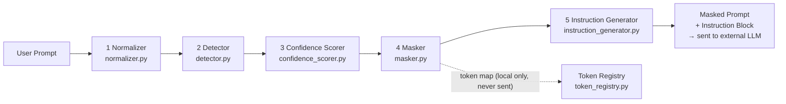
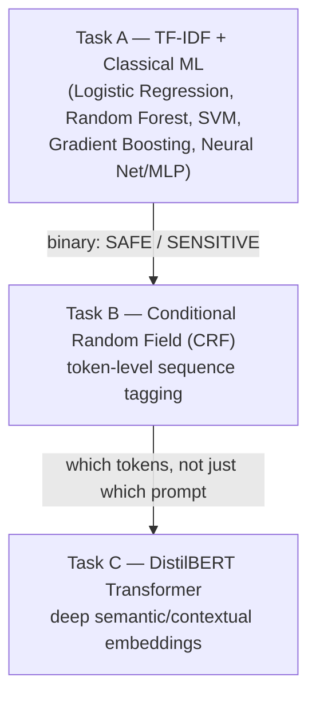

# R26-CS-012 — Context-Aware Masking + Instruction Engine
## Comprehensive Technical Documentation (Research Evaluation Panel)

**Project title:** AI-Safe Data Masking and Leakage Prevention Framework
**Component documented:** Context-Aware Masking + Instruction Engine
**Author:** Abayathilake S.S — IT22193186
**Domain:** Banking Sector (Sri Lanka + International)
**Document scope:** System architecture, detection/masking logic, semantic (ML/NLP) handling, evaluation results, and known limitations of the current implementation.

---

## 1. Executive Summary

Large Language Model (LLM) assistants (ChatGPT, Copilot, Gemini, Claude) are increasingly used inside banking workflows, but employees routinely paste real customer data, credentials, and internal system details into these prompts. Once sent, that data leaves the organization's security boundary.

This project implements a **pre-transmission masking layer**: a pipeline that sits between the user and the external LLM, scans every prompt, detects sensitive data against a purpose-built **7-category sensitive-data taxonomy** (banking PII, PCI card data, credentials, infrastructure secrets, banking-specific data, contextual leaks, and cloud architecture secrets), assigns each detection a **traceable confidence score**, masks it with a strategy appropriate to its risk level, and appends **explicit instructions** telling the LLM not to try to reconstruct the masked values.

The production pipeline is **deterministic and dependency-free** (pure Python 3.8+, regex + rule-based logic — no ML model is loaded at runtime), which matters for a banking context: every masking decision must be explainable and auditable for PCI-DSS/GDPR/CBSL/SWIFT-CSP compliance. A separate **research track** explores whether statistical ML (TF-IDF classifiers, Conditional Random Fields) and transformer models (DistilBERT) can catch *semantically* sensitive content that has no fixed regex shape — this is documented in Section 8 and is **not yet wired into the live pipeline**; that distinction is deliberate and is treated as a phase-2 research question, not an oversight.

**Current measured accuracy** (`evaluate.py` against a 3,753-prompt synthetic dataset): **Precision 0.912 / Recall 0.918 / F1 0.915**, with a **96.4% adversarial-obfuscation detection rate** and a **0.0% edge-case false-positive rate**.

---

## 2. Problem Statement & Motivation

| Risk | Example |
|---|---|
| PII leakage | A support agent pastes a customer's NIC and phone number into ChatGPT to "draft a reply." |
| PCI-DSS violation | A developer pastes a card number + CVV while debugging a payment failure. |
| Credential leakage | A developer pastes an API key or a database connection string to ask "why is this failing?" |
| SWIFT/regulatory exposure | A back-office prompt includes an MT103 message reference — a SWIFT CSP Mandatory Control 6.1 violation. |
| Architectural leakage | An AWS ARN or S3 bucket name reveals internal cloud topology, even without credentials attached. |

None of these require malicious intent — they are normal "let me get help from AI" behavior. The engine's job is to make that behavior safe **without blocking the user's workflow**: mask what's sensitive, keep the rest of the prompt intact, and preserve enough structure (`<API_KEY_1>`, `077****567`) that the LLM's answer still makes sense.

---

## 3. High-Level Architecture

The engine is a **five-stage sequential pipeline**. Every prompt passes through all five stages; there is no early-exit shortcut, so the same guarantees apply to every input regardless of content.



**Design principle — determinism over prediction:** every stage is regex/rule-based rather than model-based. This is a conscious trade-off: it sacrifices the ability to catch entirely novel, format-free sensitive phrases (what a semantic/ML model could catch — see Section 8) in exchange for outputs that a compliance auditor can trace back to a specific rule, with zero external dependencies (it can run fully air-gapped inside a bank's network) and zero non-determinism (the same input always produces the same masking decision).

### 3.1 Stage-by-stage summary

| # | Stage | File | Input → Output | Purpose |
|---|---|---|---|---|
| 1 | **Normalizer** | `engine/normalizer.py` | raw text → normalized text + context type + transformation log | Defeats adversarial obfuscation (spaced-out digits, URL/hex/Base64 encoding) and classifies the prompt's *context type* (natural language / source code / config file / log output / mixed) |
| 2 | **Detector** | `engine/detector.py` | normalized text → list of `DetectedEntity` | Runs ~30 compiled regex patterns (per taxonomy category) plus lightweight rule-based NER (names, addresses, DOB) against both the normalized and de-spaced text |
| 3 | **Confidence Scorer** | `engine/confidence_scorer.py` | entities + text → list of `ScoredEntity` (0.00–1.00 + action) | Resolves ambiguity (e.g. "is this 12-digit number an NIC or a random serial?") using a 4-factor weighted score; also resolves overlapping/competing detections |
| 4 | **Masker** | `engine/masker.py` | scored entities + text → `MaskedResult` | Chooses one of 4 masking strategies per entity and rewrites the prompt; records what was masked and what was skipped and why |
| 5 | **Instruction Generator** | `engine/instruction_generator.py` | `MaskedResult` → instruction payload | Appends a Standard or CRITICAL instruction block telling the downstream LLM not to reconstruct/guess masked values |

A sixth component, the **Token Registry** (`engine/token_registry.py`), runs alongside stage 4: it is a session-scoped, in-memory map that guarantees the *same* real value always maps to the *same* token (`<APIKEY_1>`) within a session, and is **never transmitted** — it exists purely so the calling application can un-mask the LLM's reply locally if needed.

---

## 4. Deep Dive: Each Stage

### 4.1 Normalizer — defeating obfuscation, classifying context

Before any pattern matching happens, the normalizer runs four transformations, in this fixed order, so later steps see clean data:

1. **URL-decode** (`password%3DSecure99%40` → `password=Secure99@`)
2. **Hex-decode** long even-length hex runs that decode to printable text
3. **Base64-decode** candidate segments ≥20 chars (with a carve-out: strings starting `eyJ` — the Base64 signature of `{"` — are left alone so the dedicated JWT pattern can match the three-part `xxxxx.yyyyy.zzzzz` structure instead of being destroyed by decoding)
4. **Adversarial spacing removal** — collapses spaced-out identifiers (`1 9 9 0 1 2 3 4 5 V` → `199012345V`, `199-012-345-V` → `199012345V`)

Step 4 is scoped narrowly (3+ consecutive short tokens containing ≥2 digits, or 4+ single-character tokens for a spelled-out keyword like `P a s s w o r d`) specifically so it does **not** collapse ordinary sentences ("he is to go") into false API-key-shaped strings — an earlier, looser version of this rule was a real bug fixed during the accuracy pass (Section 9).

Because the de-spacing step shortens the text, the normalizer also returns a **character-index map** (`despaced_map`) so that a match found in the shortened "despaced" copy can be translated back to the correct span in the original text — this is what lets the detector run a second adversarial-detection pass without corrupting mask positions.

The normalizer also does lightweight **context-type classification** (`natural_language`, `source_code`, `config_file`, `log_output`, `mixed`) by pattern-matching structural indicators (`def foo(`, `KEY=VALUE`, timestamps + `ERROR`/`DEBUG`, conversational phrases like "please"/"can you"). This is used for interpretability/audit logging (which category of prompt triggered a mask) — see Section 8 for how this maps to taxonomy-driven detection priority.

### 4.2 Detector — regex + rule-based NER

`detector.py` holds a registry of **~30 compiled regex patterns**, one row per taxonomy entity type, e.g.:

```python
("NIC_OLD",   r'\b\d{9}[vVxX]\b',              "HIGH",     "1A", "exact"),
("PAN",       r'\b\d(?:[ \-]?\d){12,18}\b',    "CRITICAL", "2A", "partial"),
("PRIVATE_KEY", r'-----BEGIN (RSA |EC )?PRIVATE KEY-----', "CRITICAL", "3C", "exact"),
```

Alongside regex, three entity types use **lightweight rule-based NER** (a dependency-free substitute for a full NLP NER model like spaCy):

- `FULL_NAME` — title + capitalized name, or first-name + a curated list of Sri Lankan surnames (`sl_names.py`, shared with the dataset generator so the two can't drift apart)
- `DATE_OF_BIRTH` — DOB keyword + date, or bare ISO date
- `HOME_ADDRESS` — number + street-type keyword (Road/Street/Lane/Mawatha/…)

Several structural safeguards keep detection precise:

- **Keyword-gated detection types** (`CVV`, `TAX_ID`, `BANK_ACCOUNT_NO`, `API_KEY_GENERIC`) are only registered as candidates at all if a relevant keyword appears within ±5 tokens (or glued directly onto the value, e.g. `api_key=VALUE`) — a bare 3-digit number is not, by itself, a CVV candidate.
- **Ambiguous type groups** (e.g. `NIC_NEW` vs `BANK_ACCOUNT_NO`, both 10–16 digit numbers) are deliberately allowed to both match the same span; the confidence scorer picks the winner later based on context, not on which regex happened to be registered first.
- **Container types** (`PAN`, `JWT_TOKEN`, `JWT_IN_LOG`) "claim" their whole matched span so their internal digit/segment groups aren't independently re-matched as smaller entities (a spaced-out 16-digit PAN doesn't also get torn into four separate CVV candidates).
- The detector runs **twice** — once on the normalized text, once on the de-spaced text — so adversarially spaced identifiers are still caught, with positions translated back via `despaced_map`.

### 4.3 Confidence Scorer — 4-factor weighted scoring

This is the component that resolves the taxonomy's own worked ambiguity example: *"the number `200423910321` could be an NIC or a random serial number — how does the engine decide?"*

Every detected entity gets a score in **[0.00, 1.00]** from four weighted factors:

| Factor | Weight | What it measures |
|---|---|---|
| **Pattern Match Strength** | 40% | Exact vs. partial regex match quality (most types score 1.0 automatically; a few types like `PASSPORT`, `SWIFT_BIC`, `API_KEY_GENERIC` are graded more precisely based on internal structure) |
| **Context Keyword Proximity** | 30% | Is a relevant keyword (`nic`, `password`, `api_key`, …) within ±5 tokens, or a partial/root match? |
| **Co-occurrence Boost** | 20% | Do other detected entities appear in the same prompt — especially a curated "dangerous pair" (Name+NIC, Email+Password, AWS key pair, …)? |
| **Format Validity** | 10% | Does the value pass a structural check — Luhn (card numbers), NIC digit-sum/date-of-birth-plausibility, IBAN length/country-code, Sri Lankan mobile/landline prefix table, etc.? |

```
weighted_score = 0.40·pattern + 0.30·keyword_proximity + 0.20·co_occurrence + 0.10·format_validity
```

The resulting score maps to an action:

| Score | Confidence | Action |
|---|---|---|
| 0.90 – 1.00 | Very High | `mask_immediate` |
| 0.75 – 0.89 | High | `mask_immediate` |
| 0.50 – 0.74 | Medium | `mask_warn` (masked + logged for review) |
| 0.25 – 0.49 | Low | `log_suspected` (not masked, flagged) |
| 0.00 – 0.24 | Very Low | `ignore` (treated as false positive) |

**Worked example** (from the taxonomy spec, reproduced by the engine): `"Customer reference: 200423910321"` → pattern match (0.40) + partial keyword match "reference", not "nic" (0.15) + no co-occurring PII (0.00) + format check passes (0.10) = **0.65 → Medium → mask with warning**, vs. the same number with zero context scoring ≤0.40 and never being masked at all.

**Overlap resolution:** because the detector deliberately lets ambiguous type-pairs (e.g. `NIC_NEW`/`BANK_ACCOUNT_NO`) both match the same span, `resolve_overlapping_entities()` runs after scoring and keeps only the higher-scoring candidate per contested span — so the *decision* about what a number "really is" is made by context and validators, not by which pattern was registered first in the source file.

### 4.4 Masker — four masking strategies

| Strategy | When | Example |
|---|---|---|
| **Full Mask** | CRITICAL/HIGH PII, CVV, passwords, private keys | `P@ssw0rd` → `********` |
| **Partial Mask** | MEDIUM sensitivity — phone, email, PAN | `0771234567` → `077****567`, `4111...1111` → `4111 **** **** 1111`, `saman@x.com` → `s***@x.com` |
| **Tokenization** | Credentials, IDs, cloud resources needing cross-prompt traceability | `sk-abc123...` → `<APIKEYGE_1>` |
| **Contextual** | LOW sensitivity types (`FULL_NAME`, `GENDER`, `RACE_ETHNICITY`) | A name mentioned alone is **not** masked; the same name is masked if a HIGH/CRITICAL entity co-occurs in the same prompt (e.g. Name + NIC) |

Entities are replaced **right-to-left** by character position so earlier replacements never shift the offsets of entities still waiting to be masked. The overall prompt risk level is the highest individual entity sensitivity found (`CRITICAL > HIGH > MEDIUM > LOW`).

### 4.5 Token Registry — idempotent, session-scoped, local-only

```python
registry.get_or_create_token("sk-abc123...", "API_KEY_GENERIC")   # → "<APIKEYGE_1>"
registry.get_or_create_token("sk-abc123...", "API_KEY_GENERIC")   # → "<APIKEYGE_1>"  (same value, same session)
registry.get_or_create_token("sk-xyz999...", "API_KEY_GENERIC")   # → "<APIKEYGE_2>"  (different value → incremented)
```

This matters for multi-turn conversations: if `<PERSON_1>` appears in prompt 1 and prompt 3 of the same session, the LLM should treat it as the same entity for conversational coherence, without the actual name ever being transmitted. The map lives only in the calling process's memory, is destroyed when the session ends, and — critically — **is never part of the payload sent to the external LLM.**

### 4.6 Instruction Generator — the second half of the defense

Masking alone does not stop an LLM from *guessing* what a masked value probably was. Every processed prompt is paired with an instruction block appended before it reaches the external LLM:

- **Standard tier** (MEDIUM/LOW risk): 5 instructions — don't infer/reconstruct masked tokens, treat them as opaque placeholders, don't ask the user to reveal them, treat repeated tokens as the same entity.
- **CRITICAL tier** (HIGH/CRITICAL risk, or any of `CVV`/`PRIVATE_KEY`/`SWIFT_MT103`/`SWIFT_MT202`/`PASSWORD`/`JWT_TOKEN`/`AWS_SECRET_KEY`/`DB_CONNECTION_STRING` present): the same instructions plus explicit "flag for security review" language, worded to satisfy **SWIFT CSP Mandatory Control 6.1**.
- If any tokens were used, a dynamic idempotency note is appended listing exactly which tokens are session-consistent.

---

## 5. Sensitive Data Taxonomy (What the Engine Is Built Against)

The taxonomy (`sensitive_data_taxonomy_v2.md`, v2.0) is the **ground-truth spec** the engine implements against — every regex, keyword list, and scoring rule traces back to a row in this document. It defines **7 top-level categories**:

```
1. Personally Identifiable Information (PII)     — NIC, passport, phone, email, address, name, DOB
2. Financial & Payment Data                      — card (PCI-DSS), bank account, IBAN, SWIFT, transactions
3. Credentials & Authentication Secrets          — API keys, JWTs, passwords, private keys
4. Configuration & Infrastructure Secrets        — env vars, DB connection strings, internal IP/hostnames
5. Banking-Specific Organizational Data          — customer/loan IDs, credit score, SAR/AML/KYC, SWIFT refs
6. Contextual & Implicit Sensitive Data          — credentials in code comments, internal doc references
7. Cloud Infrastructure & Architecture Secrets   — AWS ARNs, S3/Azure/GCS references, encoded secrets
```

It maps to six regulatory frameworks: **GDPR**, **PCI-DSS v4.0**, **CBSL** (Central Bank of Sri Lanka), **SWIFT CSP**, **HIPAA**, and **ISO/IEC 27001**. The current engine implements detection for **~30 entity types** spanning categories 1A/1B/1C, 2A/2B/2C, 3A/3B/3C, 4B/4C, 7A/7B/7C — the full list is in `masking_engine/README.md`'s taxonomy coverage table.

**Sensitivity scoring matrix** (drives default masking strategy before confidence adjustment):

| Level | Score | Examples |
|---|---|---|
| CRITICAL | 10 | CVV, SWIFT messages, private keys, SAR data |
| HIGH | 7–9 | API keys, NIC, IBAN, JWT, passwords, cloud keys |
| MEDIUM | 4–6 | Phone, email, internal IP, S3 bucket, hostname |
| LOW | 1–3 | Names alone, currency amounts, GCP project IDs |

**Co-occurrence elevation rules** — some combinations are more dangerous together than either value is alone:

| Combination | Individual | Elevated to |
|---|---|---|
| Name + NIC | LOW + HIGH | CRITICAL |
| Email + Password | MEDIUM + HIGH | CRITICAL |
| Account No + Balance + Name | HIGH + HIGH + LOW | CRITICAL |
| AWS ARN + AWS Secret Key | MEDIUM + HIGH | CRITICAL |

---

## 6. How the Engine Handles Semantic / Ambiguous Input

This is the question a research panel is most likely to probe: **regex can only match fixed syntax — how does a rule-based system handle meaning?** The project answers this in two layers, one shipped and one research-stage.

### 6.1 Shipped today: context-driven disambiguation (not true semantics, but not naive regex either)

The live pipeline does not "understand" language the way an embedding model does, but it does **use surrounding context to resolve ambiguity that a bare regex cannot** — this is the entire purpose of the confidence-scoring stage (Section 4.3):

- A structurally identical 12-digit number is treated completely differently depending on **what words surround it** ("Customer reference: …" scores Medium; the same digits with no surrounding keyword and no co-occurring PII are never masked at all).
- **Context-type classification** (Section 4.1) changes what the prompt *looks like structurally* — natural language vs. source code vs. config file vs. log output — which is itself a coarse semantic signal used for audit/prioritization.
- **Co-occurrence reasoning** is a limited form of relational understanding: the engine doesn't just ask "is this value sensitive," it asks "is this value sensitive *given what else is in the same prompt*" (Name + NIC together implies a real, identifiable customer record; either alone does not).
- **Known, documented limitation:** keyword-proximity heuristics cannot resolve genuine linguistic ambiguity. "Debit LKR 50,000 from account X" still matches the `PAN` boost-keyword list because "debit card" is a legitimate adjacent phrase — the engine has no part-of-speech awareness to know "Debit" is being used as a verb here, not as "debit card." This is called out explicitly as a scope boundary in `Model_Regex_Docs.md` rather than left as a silent gap.

In short: the production engine achieves **contextual disambiguation without machine learning**, using proximity/co-occurrence/structural-validation heuristics that are fully traceable to a specific rule — which is exactly what a regulator/auditor needs, at the cost of not generalizing to sensitive content with no fixed shape and no nearby keyword.

### 6.2 Research track: true semantic understanding via ML (not yet in production)

Because pure regex/keyword logic cannot flag sensitive content that has **no predictable format and no nearby keyword** — e.g., a randomly-generated password with no `password:` prefix, or a paragraph that describes sensitive information in prose rather than a structured value — the project maintains a **separate research pipeline** (`masking_engine/research/`, built via `build_notebook.py` → `Colab_Masking_Engine_Lab.ipynb`) exploring three escalating layers of semantic detection:



**Task A — Statistical classifiers over engineered features, not raw text.** Deliberately avoids feeding raw tokens to the classifier (which would let it memorize synthetic template wording instead of learning generalizable signal — a data-leakage risk called out explicitly in the design). Instead it extracts **17 character-level / entropy-based features** per prompt:
- Shannon entropy (`mean_token_entropy`, `max_token_entropy`) — high randomness is a strong signal for keys/tokens/hashes, independent of any specific format
- Length signals (`long_token_ratio`) — sensitive tokens (JWTs, connection strings) are unusually long vs. natural-language words
- Structural counts (`n_digit_runs`, `n_special_chars`) and pattern flags (`has_base64_pattern`, `has_hex_run`)

Evaluated with **stratified 5-fold cross-validation**; Gradient Boosting and a small MLP neural network performed best, balancing precision/recall on the classifier's own held-out synthetic test set (~98% accuracy there).

**Task B — CRF for token-level tagging.** Where the classifier only answers "does this *prompt* contain something sensitive," the CRF answers "*which tokens, specifically*" — it labels each word (`O` / `B-SENSITIVE`) using features of the word itself **plus its immediate left/right neighbors** (`word[i-1]`, `word[i+1]`), which is the closest thing to sequence-aware "meaning" in the research stack: a word following "Password:" is far more likely to be tagged sensitive than the same word in isolation.

**Task C — DistilBERT (transformer).** The explicit "semantic" layer: a pretrained language model carries contextual/semantic representations that let it flag content by *intent* rather than *format* — e.g., recognizing a sentence is describing a secret even when the secret itself doesn't match any known regex shape. This is the layer that would most directly answer "how does this work for semantic inputs" in the fullest sense.

**Why this is not wired into the live pipeline yet — stated plainly, not glossed over:**
1. `main.py`/`evaluate.py` never import or load `models_rf_classifier.pkl` / `models_crf_ner.pkl`. Live detection is **100% regex + rule-based scoring**.
2. The classifier's entropy/structural feature design (chosen specifically to *avoid* memorizing synthetic template text) means it **doesn't reliably generalize** to hand-written prompts whose sensitivity is keyword/format-based (credit card numbers, DB connection strings) rather than high-entropy (API keys, tokens) — it currently over-indexes on randomness as the signal for "sensitive."
3. Genuinely closing that gap would require keyword/contextual features on a **leakage-aware dataset split**, which reopens exactly the memorization risk the entropy-only design was built to avoid — a real methodological trade-off, not a scheduling gap.

**Planned integration** (documented in `masking_engine_architecture.md` as the target production flow, not yet built): Regex Scan (deterministic, fast) → Classifier Gateway (flags residual risk in what regex missed) → CRF Deep Scan (pinpoints exactly which tokens) → Mask. This keeps regex as the fast, auditable first line of defense and reserves ML for exactly the cases regex is structurally unable to catch — an explicit, staged rollout rather than a full replacement of the deterministic layer (which the compliance requirement in Section 4.2 still needs for auditability).

---

## 7. Evaluation Results

Run via `python evaluate.py` against `data/synthetic_dataset.json` — **3,753 prompts** (2,251 normal / 752 edge-case / 750 adversarial), generated by `data/generate_dataset.py` from Faker + a custom Sri Lankan NIC/phone generator + a custom banking-prompt generator, each with obfuscated/adversarial variants per the taxonomy's dataset strategy (Section 12).

### 7.1 Overall metrics

| Metric | Value |
|---|---|
| **Precision** | **91.2%** |
| **Recall** | **91.8%** |
| **F1 Score** | **91.5%** |
| True Positives | 4,280 |
| False Positives | 413 |
| False Negatives | 383 |
| **Adversarial detection rate** | **96.4%** |
| **Edge-case false-positive rate** | **0.0%** |

> These numbers reflect a documented accuracy-fix pass (Section 9) that raised overall F1 from **~0.46 to ~0.91** — the earlier figure came from bugs in the detector/normalizer/scorer, not from a change in the taxonomy or dataset.

### 7.2 Per-entity-type highlights

Most entity types with a fixed, unambiguous format achieve **perfect or near-perfect** precision/recall — e.g. `API_KEY_OPENAI`, `AWS_ACCESS_KEY`, `CVV`, `DATE_OF_BIRTH`, `DB_CONNECTION_STRING`, `DRIVING_LICENSE`, `EMAIL`, `IBAN`, `JWT_TOKEN`, `NIC_OLD`, `S3_BUCKET_REF`, `SWIFT_MT103`, `SWIFT_MT202`, `TAX_ID` all score **F1 = 1.00**.

The lower-scoring types are all explainable, not silent failures:

| Entity Type | Precision | Recall | F1 | Why |
|---|---|---|---|---|
| `NIC_NEW` | 63.8% | 100% | 0.78 | Inherently ambiguous 12-digit shape; the engine deliberately errs toward flagging (recall) over silently missing real NICs, at the cost of some FPs on coincidentally NIC-shaped numbers |
| `PASSPORT` | 65.2% | 100% | 0.79 | Same structural-ambiguity trade-off (2 letters + 6–7 digits collides with other identifier formats) |
| `FULL_NAME` | 100% | 52.6% | 0.69 | **Not a detection miss** — by taxonomy design (Section 4.5), a name mentioned *alone* is correctly left unmasked; recall looks low in aggregate because most of the "gap" is names correctly *not* masked in isolation, verified separately at the detector level in `tests/test_detector.py` |
| `PASSWORD` | 100% | 59.1% | 0.74 | Regex requires an explicit `password/passwd/pwd` keyword adjacent to the value — passwords stated without that keyword are out of scope by design, not a bug |
| `INTERNAL_IP` | 77.4% | 100% | 0.87 | Regex restricts to RFC1918 private ranges but this occasionally over-flags coincidental private-range-shaped numbers in non-IP contexts |
| `HOME_ADDRESS` | 77.9% | 94.0% | 0.85 | Rule-based NER (no full NLP parser) trades some precision for high recall on catching addresses |

### 7.3 Masking action distribution

From the same evaluation run: **2,797** entities masked immediately (`mask_immediate`), **1,875** masked with a warning log (`mask_warn`), **439** logged as suspected but *not* masked (`log_suspected`) — i.e. the confidence-scoring stage is doing real triage work, not just a binary mask/don't-mask decision.

---

## 8. Documented Deviations From the Taxonomy Spec (Empirically Justified)

During the accuracy-fix pass, three places where the engine's actual behavior **intentionally departs** from the taxonomy document's literal wording were identified and recorded (not silently changed):

1. **"Any 3+ entities → CRITICAL" rule (Taxonomy §7).** Applied literally as a blanket entity-count trigger, this amplified clusters of unrelated false positives into forced CRITICAL status. The engine now applies a **graduated 0.75 boost** for 3+ unrelated entity types, and reserves the hard CRITICAL elevation for the curated `CO_OCCURRENCE_PAIRS` relationships (Name+NIC, Email+Password, etc.), which are still forced to CRITICAL exactly as the taxonomy specifies.
2. **Format-validity credit for ambiguous digit-shaped types.** A literal reading of the 4-factor formula could let a bare, contextless 12-digit number reach 0.50 (pattern 0.40 + a lenient structural pass 0.10) — crossing into `mask_warn` even though the taxonomy explicitly says such numbers should score ≤0.40 and not be masked. Format-validity credit for `NIC_NEW`/`NIC_OLD`/`TAX_ID`/`BANK_ACCOUNT_NO`/`PAN` is now only counted when there's *some* other corroborating signal.
3. **Detection-time keyword gating.** The taxonomy already specifies `CVV`/`TAX_ID`/`BANK_ACCOUNT_NO`/`API_KEY_GENERIC` as "Regex + keyword," but the keyword requirement was previously enforced only in scoring, not detection — so a bare match still registered as a real (if low-scoring) detection, which `evaluate.py` counted as a false positive. These types now require the keyword to be present to be registered as a candidate at all.

**Known limitation not treated as a bug:** keyword-proximity heuristics cannot resolve genuine part-of-speech ambiguity (the "Debit LKR 50,000" example, Section 6.1) — flagged as requiring POS-aware NLP, explicitly out of scope for the current regex+keyword design.

---

## 9. Testing & Validation

| Suite | File | Purpose |
|---|---|---|
| Regression tests | `tests/test_detector.py` (241 lines) | Locks in the phone/CVV/PAN/JWT/etc. accuracy fixes so they can't silently regress |
| Web API tests | `tests/test_web_api.py` (116 lines) | HTTP/JSON contract tests for `web/server.py` |
| ML smoke test | `research/test_model.py` | Confirms the trained classifier/CRF models load and predict sensibly (research artifact only) |

Run via:
```bash
cd masking_engine
python -m unittest discover -s tests -v
```

---

## 10. Interfaces

### 10.1 CLI (`main.py`)

```bash
python main.py --demo                 # 12 built-in demo cases covering every taxonomy category
python main.py --text "..."           # process a single prompt
python main.py --file prompts.txt     # batch process
python main.py                        # interactive multi-turn session (type 'tokens' to inspect the session registry)
```

The interactive mode demonstrates session idempotency directly: the same API key pasted in prompt 1 and prompt 3 always resolves to the same `<APIKEYGE_1>` token.

### 10.2 Local Web Demo (`web/server.py`)

A zero-dependency `http.server`-based backend (`ThreadingHTTPServer`) exposing the **real** pipeline (not a reimplementation) as a JSON API, with a static HTML/CSS/JS frontend:

```bash
python web/server.py     # serves http://127.0.0.1:8765, opens automatically
```

- `GET /api/demo-cases` → the same 12 cases used by `main.py --demo`
- `POST /api/detect` `{ "text": "..." }` → full pipeline output: normalization transformations applied, context type, every detected entity with its matched regex pattern, full confidence-score breakdown (all 4 factors), masked text, and overall risk

This is the tool best suited for a **live evaluation-panel demo** — it shows the exact regex responsible for each detection and the full scoring breakdown per entity, which makes the "why did it decide this" question answerable in real time.

### 10.3 Evaluation harness (`evaluate.py`)

```bash
python evaluate.py
```
Produces `data/eval_results.csv` (per-prompt detail) and `data/eval_metrics.json` (aggregate metrics — the source of Section 7's numbers above).

---

## 11. Project Structure

```
ContextMaskingPlus/
├── README.md                          # repo-level orientation
├── masking_engine_architecture.md     # pipeline design walkthrough
├── sensitive_data_taxonomy_v2.md      # ground-truth taxonomy spec (v2.0)
├── requirements.txt                   # deps for research/ notebook ONLY
├── archive/                           # superseded scratch scripts (not active)
└── masking_engine/                    # the actual project
    ├── engine/                        # production pipeline — zero dependencies
    │   ├── normalizer.py
    │   ├── detector.py
    │   ├── confidence_scorer.py
    │   ├── masker.py
    │   ├── token_registry.py
    │   └── instruction_generator.py
    ├── data/
    │   ├── generate_dataset.py        # synthetic dataset generator
    │   ├── synthetic_dataset.json     # 3,753 generated prompts
    │   ├── eval_results.csv
    │   └── eval_metrics.json
    ├── web/                           # local browser demo, zero dependencies
    │   ├── server.py
    │   ├── index.html / style.css / app.js
    ├── research/                      # ML research lab — separate from engine/, has its own deps
    │   ├── Colab_Masking_Engine_Lab.ipynb
    │   ├── build_notebook.py          # regenerates the notebook (edit this, not the .ipynb)
    │   ├── models_rf_classifier.pkl   # Task A trained classifier
    │   └── models_crf_ner.pkl         # Task B trained CRF NER model
    ├── tests/
    │   ├── test_detector.py
    │   └── test_web_api.py
    ├── sl_names.py                    # shared SL surname list (detector NER + dataset generator)
    ├── main.py                        # CLI entry point
    ├── evaluate.py                    # precision/recall/F1 evaluation
    └── Model_Regex_Docs.md            # technical deep-dive + documented taxonomy deviations
```

---

## 12. Compliance Alignment

| Standard | Jurisdiction | How this project addresses it |
|---|---|---|
| **GDPR** Art. 4 | EU | Masks PII (NIC-equivalent IDs, names, addresses, DOB) before it leaves the organization |
| **PCI-DSS v4.0** | International | CVV always CRITICAL/full-mask with no exceptions; PAN validated via Luhn before masking; card data never transmitted unmasked |
| **CBSL** (Banking Act No. 30 of 1988) | Sri Lanka | Sri Lanka-specific NIC (old/new format), phone, and banking-identifier detection with local structural validators |
| **SWIFT CSP** Mandatory Control 6.1 | International | Any SWIFT message data (MT103/MT202/field references) is forced CRITICAL and triggers the CRITICAL instruction tier regardless of confidence score |
| **HIPAA** | USA | Out of current entity scope (no health-data patterns implemented) — architecture supports adding a category |
| **ISO/IEC 27001** | International | Deterministic, auditable rule-based detection — every masking decision traces to a specific regex/rule, satisfying explainability requirements for an ISMS audit |

---

## 13. Known Limitations (Explicitly Scoped, Not Hidden)

- **No true semantic detection in production** — sensitive content with no fixed format and no nearby keyword (e.g., a password with no `password:` prefix, or prose describing sensitive information) is out of reach of the current regex+keyword design. This is exactly the gap the research track (Section 6.2) targets.
- **POS-unaware keyword matching** can false-positive on legitimate phrases that share vocabulary with a boost keyword (e.g., "Debit LKR 50,000" vs. "debit card").
- **ML classifier doesn't yet generalize** beyond its entropy/structural feature design to keyword/format-based sensitive content.
- **Explicitly out of scope for this component** (per taxonomy §13): Sinhala/Tamil NER, OCR/image extraction, audio/video analysis, inbound *AI-response* filtering (this engine only guards the outbound prompt), real-time threat-intel feeds, SWIFT network-level interception (prompt-level only).

---

## 14. Roadmap (Stated Direction, Not Yet Built)

1. Wire the Task A classifier in as a **gateway** after the regex pass — flag prompts the regex layer scored as clean but that carry high aggregate entropy, for CRF deep-scan.
2. Retrain the classifier on a **leakage-aware dataset split** that includes keyword/contextual features, to close the format-based-secret generalization gap, without reintroducing template memorization.
3. Extend Task C (DistilBERT) from a research notebook into a lightweight production inference path, scoped to only the residual cases the deterministic layers cannot resolve — keeping the fast/auditable regex layer as the default path for compliance reasons.
4. Extend taxonomy coverage to HIPAA-relevant health data categories if the domain scope expands beyond banking.

---

## 15. Conclusion

The engine currently ships a **complete, deterministic, taxonomy-driven masking pipeline** — normalize → detect → score → mask → instruct — that achieves **91.5% F1** and a **96.4% adversarial-detection rate** on a 3,753-prompt evaluation set, with every masking decision traceable to a specific regex pattern, keyword, or validator for compliance auditability. Ambiguity that a bare regex cannot resolve (is this number an NIC, a serial, or a random identifier?) is handled through a transparent 4-factor confidence score rather than a black-box model.

True **semantic** understanding — flagging sensitive content that has no fixed format at all — is treated as a distinct, harder research problem, explored in a parallel ML/NLP track (TF-IDF classifiers → CRF sequence tagging → DistilBERT transformers) that is deliberately **not yet integrated into the live pipeline**, both because its current feature design doesn't yet generalize to keyword/format-based secrets and because a banking deployment requires the auditability that only the deterministic layer currently guarantees. This separation — a production-grade rule engine plus an explicitly-scoped research track toward semantic detection — is presented as the project's core architectural decision, not as an incomplete feature.
